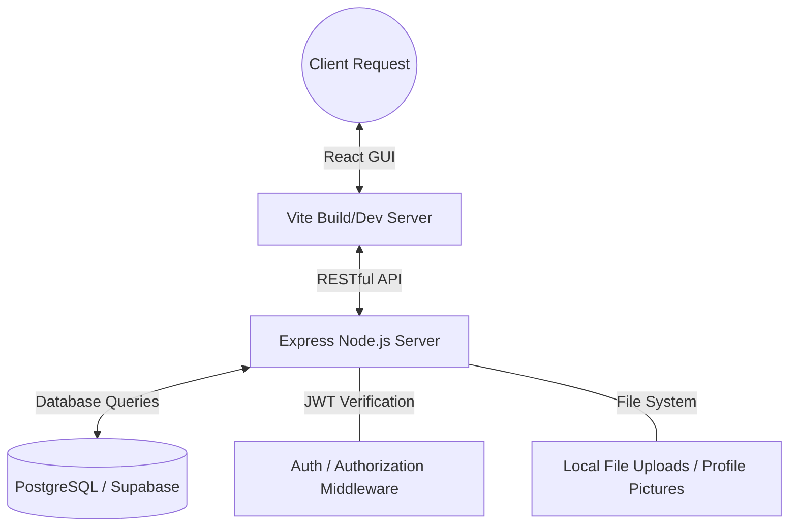

# RegisSPHERE

RegisSPHERE is a modern, comprehensive student portal and university management system designed to streamline the academic experience. Built with a focus on usability and clarity, the application offers students a centralized platform to manage their profiles, perform course enrollments, track class schedules, and monitor academic performance.

## Key Features

- **Dynamic Localization**: Integrated switching between English and Thai languages across the entire application interface.
- **Secure Authentication and RBAC**: Robust user registration and login flows utilizing JWT for session management and Bcrypt for password hashing, with support for Student, Professor, and Admin roles.
- **Admin Control Panel**: Comprehensive dashboard for administrators to oversee system operations, manage user accounts, construct the course catalog, and broadcast university-wide news.
- **Enrollment Phase Management**: Administrative controls to transition the system between Pre-Enrollment (demand gathering), Active Enrollment, and Closed phases.
- **Waitlist and Capacity Tracking**: Automated waitlist promotion when seats become available, with real-time demand monitoring for oversubscribed courses.
- **Student Dashboard**: A central hub providing a status overview, quick navigation to primary academic modules, and an aggregated news feed.
- **Professor Portal and Grading**: Dedicated tools for professors to manage assigned courses, assign grades, download rosters, and post course-specific updates.
- **University News and Announcements**: Integrated university-wide news board and course-specific announcement feeds.
- **Profile Management**: Module for secure profile picture uploads and biographical detail updates.
- **Course Enrollment**: Interactive catalog with search functionality, detailed course metrics (credits, schedules, capacity), and live enrollment management.
- **Academic Scheduling**: Detailed "My Courses" interface with enrollment overviews, visual weekly timetables (with image export), and exam schedule breakdowns.
- **Study Path Guidance**: Visual curriculum guides for tracking progress against program requirements and prerequisites.
- **Grades and Progress Tracking**: Dedicated module for viewing academic results, filtered by Academic Year, with automatic GPA and GPAX calculations.
- **Modern Interface**: Professional dark mode support and a clean UI built on global CSS variables for a consistent and responsive experience.

## Technical Specifications

The application infrastructure utilizes a modern full-stack web architecture:

| Component | Technologies Utilized |
| :--- | :--- |
| **Frontend Runtime** | React 19, Vite |
| **Frontend Libraries** | React Router DOM, Framer Motion, Lucide React, html2canvas |
| **Backend Runtime** | Node.js, Express 5 |
| **Backend Modules** | JSON Web Tokens, Bcrypt, Multer, pg |
| **Database Structure** | PostgreSQL (Supabase) |
| **Styling Protocol** | Vanilla CSS with global custom properties |

## System Architecture



## Project Structure

The repository is modularly split into the frontend client and the backend server.

```text
COOP/
├── backend/                # Node.js + Express backend server
│   ├── src/
│   │   ├── config/         # Database and connection settings
│   │   ├── controllers/    # API business logic
│   │   ├── middlewares/    # Authentication interceptors
│   │   ├── routes/         # API endpoint definitions
│   │   └── app.js          # Core Express application setup
│   ├── .env                # Environmental configuration
│   └── scripts/            # Migration and utility scripts
├── frontend/               # React client application
│   ├── src/
│   │   ├── components/     # Reusable UI components
│   │   ├── context/        # Global state management
│   │   ├── pages/          # View components
│   │   ├── translations.js # Localization dictionary
│   │   ├── App.jsx         # Primary router
│   │   └── index.css       # Global stylesheet
│   └── vite.config.js      # Build configuration
└── README.md               # Project documentation
```

## Installation and Setup

### Prerequisites

- Node.js (Version 18.x or higher)
- npm (Node Package Manager)

### 1. Repository Setup

Clone the repository and access the root directory:

```bash
git clone https://github.com/your-username/university-coop.git
cd university-coop
```

### 2. Backend Initialization

Access the backend directory and install dependencies:

```bash
cd backend
npm install
```

Configure the `.env` file in the `backend/` directory with the following variables:

```env
PORT=5000
DATABASE_URL=your_postgresql_connection_string
JWT_SECRET=your_secure_secret_key
```

Run database migrations to initialize tables and sample data:

```bash
node check_schema.js
node migrate_multiple_professors.js
node migrate_student_id.js
node migrate_announcements.js
node migrate_exam.js
node migrate_grades.js
node migrate_pre_enrollment.js
node seed_courses.js
node seed_admin.js
```

### 3. Frontend Initialization

Return to the root directory and initialize the frontend application:

```bash
cd ../frontend
npm install
```

### 4. Running the Application

The architecture requires both the server and client to run concurrently.

**Initialize Backend Server:**

```bash
cd backend
npm run dev
```

**Initialize Frontend Client:**

```bash
cd frontend
npm run dev
```

The application will be accessible at `http://localhost:5173/`.

## API Documentation

The backend service exposes several REST API domains:

| Domain | Method | Endpoint | Description |
| :--- | :--- | :--- | :--- |
| **Authentication** | `POST` | `/api/auth/register` | Account creation |
| **Authentication** | `POST` | `/api/auth/login` | Session initiation |
| **Profile** | `GET` | `/api/profile` | Retrieve user details |
| **Profile** | `PUT` | `/api/profile` | Update user biography |
| **Profile** | `POST` | `/api/profile/picture` | Handle profile picture uploads |
| **Courses** | `GET` | `/api/courses` | Retrieve course catalog |
| **Enrollment** | `POST` | `/api/enrollments` | Process new enrollment |
| **Enrollment** | `GET` | `/api/enrollments/mine` | Retrieve active enrollments |
| **Enrollment** | `DELETE` | `/api/enrollments/:id` | Drop specified course |
| **Grades** | `GET` | `/api/grades/mine` | Aggregated academic results |
| **Admin** | `GET` | `/api/admin/phase` | Retrieve enrollment phase |
| **Admin** | `POST` | `/api/admin/phase` | Update system phase |
| **Announcements** | `GET` | `/api/announcements/university` | Retrieve global news |
| **Announcements** | `POST` | `/api/announcements/university` | Post global news (Admin) |
| **Announcements** | `POST` | `/api/announcements/course/:id` | Post course update (Professor) |

## License

This software project is licensed under the ISC License.
