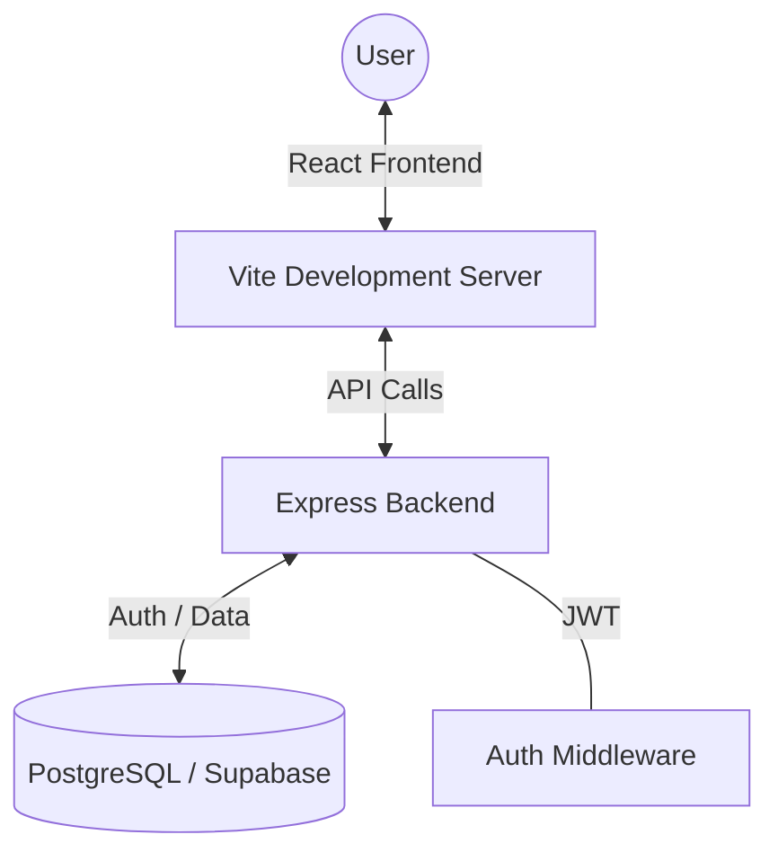

# RegiSPHERE

[](https://reactjs.org/)
[](https://vitejs.dev/)
[](https://nodejs.org/)
[](https://expressjs.com/)
[](https://www.postgresql.org/)
[](https://supabase.com/)

This project is a dedicated portal designed to streamline the cooperative education management process for university students and administrators. It focuses on providing a clean interface and a reliable workflow for handling course enrollments and program tracking.

## Core Features

- **Authentication**: A secure system built using JWT for user registration and login, ensuring data privacy and session management.
- **Dashboard**: A centralized hub that provides students with a clear overview of their progress and easy access to different sections of the portal.
- **Course Exploration**: Users can browse through the available COOP courses and view detailed information about each one.
- **Enrollment Tracking**: A simple and effective way for students to manage their course enrollments and stay updated on their status.
- **Modern Interface**: The frontend utilizes Framer Motion for subtle transitions and Lucide React for consistent iconography, all built on a responsive layout.

## Technology Stack

The application is built using a modern full-stack approach:

| Layer | Technologies |
| :--- | :--- |
| **Frontend** | React 19, Vite, React Router, Framer Motion, Lucide React, React Hook Form |
| **Backend** | Node.js, Express 5, JWT, Bcrypt for security |
| **Database** | PostgreSQL hosted on Supabase |
| **Styling** | Clean, vanilla CSS using modern properties |

## System Flow



## Folder Organization

The repository is split into two main sections: the frontend client and the backend server.

```text
COOP/
├── backend/                # Server-side logic and API
│   ├── src/
│   │   ├── config/         # Database and environment configurations
│   │   ├── controllers/    # Shared logic for handling requests
│   │   ├── middlewares/    # Authentication and security layers
│   │   ├── routes/         # Definitions of API endpoints
│   │   └── app.js          # Main application entry point
│   └── .env                # Local environment variables
├── frontend/               # Client-side React application
│   ├── src/
│   │   ├── components/     # Reusable UI components
│   │   ├── pages/          # Individual page views
│   │   ├── App.jsx         # Main routing and layout
│   │   └── main.jsx        # Application bootstrap
│   └── vite.config.js      # Build and development settings
└── README.md               # Documentation
```

## Setup and Installation

### Prerequisites
Before starting, ensure you have the following installed on your machine:
- Node.js (version 18 or higher recommended)
- npm (distributed with Node.js)

### 1. Repository Setup
First, clone the project and navigate into the root directory:
```bash
git clone https://github.com/your-username/university-coop.git
cd university-coop
```

### 2. Backend Configuration
Navigate to the backend folder and install the necessary dependencies:
```bash
cd backend
npm install
```
Create a `.env` file in the `backend/` directory with the following variables:
```env
PORT=5000
DATABASE_URL=your_postgresql_connection_string
JWT_SECRET=your_secure_random_string
```

### 3. Frontend Configuration
Go back to the root and then into the frontend folder to install its dependencies:
```bash
cd ../frontend
npm install
```

### 4. Running the Project
You will need two terminal windows to run the application locally.

**Backend Server:**
```bash
cd backend
npm run dev # or node src/app.js
```

**Frontend Client:**
```bash
cd frontend
npm run dev
```

## API Summary

The backend exposes several endpoints for data management:

| Method | Endpoint | Purpose |
| :--- | :--- | :--- |
| `POST` | `/api/auth/register` | Create a new user account |
| `POST` | `/api/auth/login` | Log in and receive an authentication token |
| `GET` | `/api/courses` | Retrieve a list of available courses |
| `GET` | `/api/enrollments` | View enrollments for the current user |

## Contributing
If you're interested in contributing, please feel free to submit a pull request or open an issue for discussion.

## License
This project is released under the ISC License.
