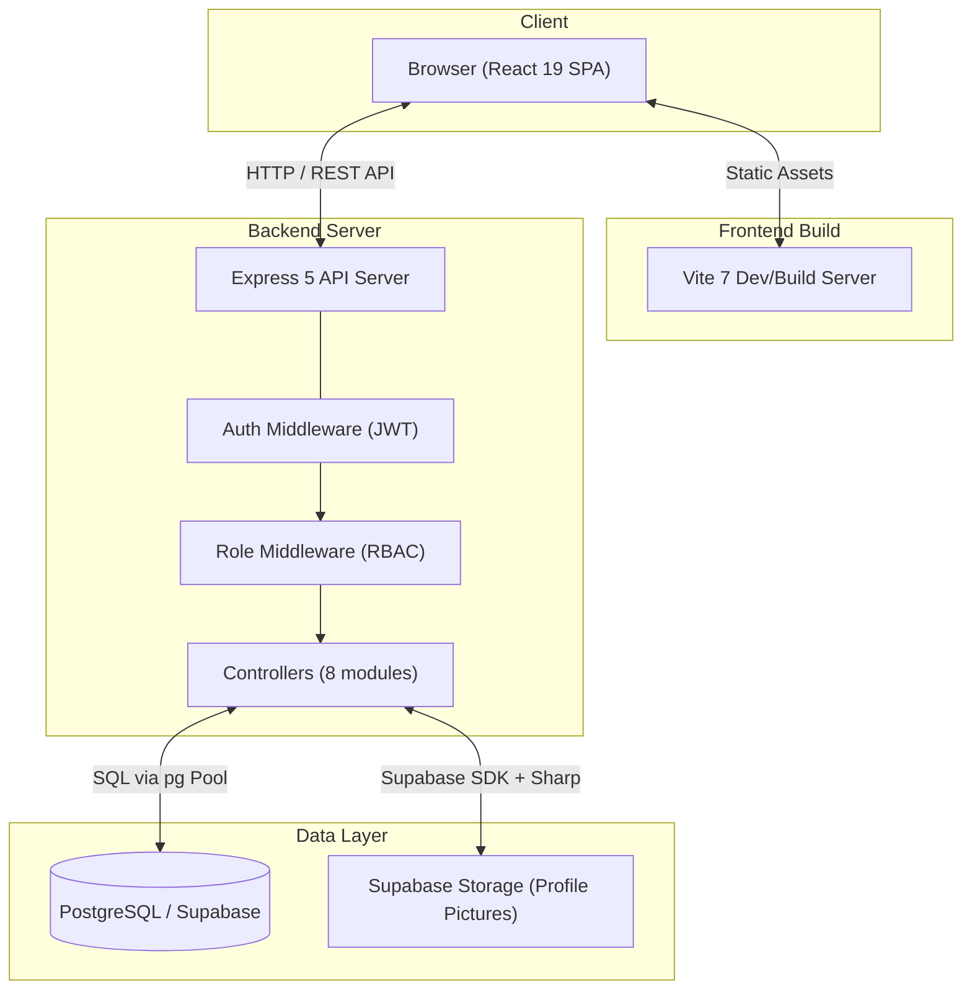

# RegisSPHERE

[](https://reactjs.org/)
[](https://vitejs.dev/)
[](https://nodejs.org/)
[](https://expressjs.com/)
[](https://www.postgresql.org/)
[](https://supabase.com/)
[](https://vercel.com/)

RegisSPHERE is a modern, full-stack university course registration and academic management system. It serves as a centralized portal where students can enroll in courses, track academic performance, and plan their study path, while professors manage classes and assign grades, and administrators oversee the entire enrollment lifecycle.

---

## Key Features

### Authentication and Authorization
- Secure registration and login using **JWT** (24-hour expiry) and **Bcrypt** password hashing.
- **Role-Based Access Control (RBAC)** with three distinct roles: Student, Professor, and Admin.
- Token-based middleware protecting all API routes with granular role permissions.

### Student Portal
- **Dashboard**: Central hub with status overview, quick navigation, and an aggregated news feed combining university-wide and course-specific announcements.
- **Course Enrollment**: Interactive catalog with search, detailed course metrics (credits, schedule, room, capacity), prerequisite validation, and time-conflict detection.
- **Pre-Enrollment and Waitlist**: Support for a pre-enrollment demand-gathering phase with automatic seat allocation and waitlist promotion when the system transitions to active enrollment.
- **My Courses**: Enrollment overview with a visual weekly timetable (exportable as image via html2canvas) and exam schedule breakdown.
- **Study Path**: Visual curriculum guide for tracking progress against program requirements, prerequisites, and course tracks (e.g. Co-op) with interactive arrow-based dependency visualization.
- **Grades and Progress**: Academic results filtered by Academic Year and Semester, with automatic per-semester GPA and cumulative GPAX calculations.
- **Profile Management**: Bio editing, year-of-study updates, and profile picture uploads optimized via Sharp (resized to 400x400 WebP) and stored in Supabase Storage.

### Professor Portal
- **Professor Dashboard**: Overview of assigned courses with enrolled student counts and a recent announcements feed.
- **Class Management**: View enrolled student rosters, assign grades (A through F scale), and download class lists as CSV.
- **Course Announcements**: Post course-specific updates visible to enrolled students.

### Admin Control Panel
- **Course Management**: Full CRUD operations for the course catalog, including assigning professors, setting capacity, credits, schedule, room, semester, year, and track.
- **Enrollment Phase Management**: Toggle the system between three phases:
  - **Pre-Enrollment** (demand gathering)
  - **Active Enrollment** (seat allocation with capacity enforcement)
  - **Closed** (no new enrollments)
- **Demand Monitoring**: Real-time dashboard showing enrolled, pre-enrolled, and waitlisted counts per course with capacity adjustment controls.
- **Student Management**: View and manage all student records, including year-of-study updates.
- **University News**: Broadcast university-wide announcements.

### User Experience
- **Bilingual Interface**: Full English/Thai localization with persistent language preference (localStorage).
- **Dark/Light Mode**: Theme toggle with CSS custom properties, persisted across sessions.
- **Animated UI**: Smooth page transitions and micro-animations powered by Framer Motion.
- **Skeleton Loaders**: Polished loading states for a seamless data-fetching experience.
- **Responsive Sidebar Navigation**: Context-aware navigation that adapts to the user's role.

---

## Technical Specifications

| Layer | Technologies |
| :--- | :--- |
| **Frontend Framework** | React 19, Vite 7 |
| **Frontend Libraries** | React Router DOM 7, Framer Motion 12, Lucide React, React Hook Form, html2canvas |
| **Backend Framework** | Node.js, Express 5 |
| **Backend Libraries** | JSON Web Tokens, Bcrypt, Multer, pg (node-postgres), Sharp, Helmet, CORS |
| **Database** | PostgreSQL (hosted on Supabase) |
| **Cloud Storage** | Supabase Storage (profile pictures) |
| **Styling** | Vanilla CSS with global custom properties and dark mode support |
| **Frontend Deployment** | Vercel (SPA rewrite rules) |
| **Backend Deployment** | Node.js hosting with environment-based configuration |

---

## System Architecture



### Request Flow

1. The React SPA sends HTTP requests to the Express API with a Bearer JWT in the Authorization header.
2. The `authenticateToken` middleware verifies the JWT and attaches user context.
3. The `requireRole` middleware enforces role-based permissions per route.
4. Controllers execute business logic and interact with PostgreSQL via the `pg` connection pool.
5. Profile picture uploads are processed through Multer (memory storage, 5MB limit), optimized by Sharp, and stored in Supabase Storage.

---

## Project Structure

```text
COOP/
├── backend/                     # Node.js + Express API server
│   ├── src/
│   │   ├── app.js               # Express app setup, middleware, route mounting
│   │   ├── config/
│   │   │   └── db.js            # PostgreSQL connection pool
│   │   ├── controllers/
│   │   │   ├── adminController.js       # Phase, demand, capacity, student mgmt
│   │   │   ├── announcementController.js # University news + course announcements
│   │   │   ├── authController.js        # Register, login, getMe
│   │   │   ├── courseController.js       # CRUD courses, rosters, CSV export
│   │   │   ├── enrollmentController.js  # Enroll, drop, waitlist promotion
│   │   │   ├── gradeController.js       # GPA/GPAX calc, grade assignment
│   │   │   ├── profileController.js     # Profile CRUD, Supabase picture upload
│   │   │   └── userController.js        # User listing
│   │   ├── middlewares/
│   │   │   └── authMiddleware.js # JWT verification + role-based access
│   │   └── routes/              # 8 route modules mapping to controllers
│   ├── scripts/                 # Database migrations and seed scripts
│   ├── uploads/                 # Legacy local upload directory
│   └── package.json
├── frontend/                    # React client application
│   ├── src/
│   │   ├── App.jsx              # Root component with React Router (14 routes)
│   │   ├── main.jsx             # Entry point
│   │   ├── config.js            # API base URL configuration
│   │   ├── index.css            # Global stylesheet with CSS custom properties
│   │   ├── translations.js     # EN/TH localization dictionary (~43KB)
│   │   ├── context/
│   │   │   ├── LanguageContext.jsx  # i18n provider (EN/TH toggle)
│   │   │   └── ThemeContext.jsx     # Dark/Light theme provider
│   │   ├── components/
│   │   │   ├── Sidebar.jsx          # Role-adaptive navigation sidebar
│   │   │   ├── LanguageSwitcher.jsx # Language toggle button
│   │   │   └── SkeletonLoader.jsx   # Loading state components
│   │   ├── pages/
│   │   │   ├── Login.jsx            # Authentication page
│   │   │   ├── Register.jsx         # Registration page
│   │   │   ├── Dashboard.jsx        # Role-based dashboard router
│   │   │   ├── StudentDashboard.jsx # Student home view
│   │   │   ├── Enrollment.jsx       # Course catalog + enrollment
│   │   │   ├── MyCourses.jsx        # Schedule, timetable, exams
│   │   │   ├── StudyPath.jsx        # Curriculum visualization
│   │   │   ├── Grades.jsx           # Academic results + GPA
│   │   │   ├── Settings.jsx         # Profile management
│   │   │   ├── ProfessorDashboard.jsx   # Professor home view
│   │   │   ├── ProfessorCourses.jsx     # Professor course list
│   │   │   ├── ProfessorClassDetails.jsx # Roster + grading
│   │   │   ├── AdminDashboard.jsx       # Admin control panel
│   │   │   ├── CourseManagement.jsx     # Course CRUD interface
│   │   │   └── StudentManagement.jsx    # Student record management
│   │   └── assets/              # Static assets (icons, images)
│   ├── public/                  # Public static files
│   ├── vercel.json              # Vercel SPA rewrite configuration
│   ├── vite.config.js           # Vite build configuration
│   └── package.json
├── .gitignore
└── README.md
```

---

## Installation and Setup

### Prerequisites

- Node.js (version 18.x or higher)
- npm
- PostgreSQL database (or a Supabase project)

### 1. Clone the Repository

```bash
git clone https://github.com/your-username/RegisSPHERE.git
cd RegisSPHERE
```

### 2. Backend Setup

```bash
cd backend
npm install
```

Create a `.env` file in the `backend/` directory:

```env
PORT=5000
DATABASE_URL=your_postgresql_connection_string
JWT_SECRET=your_secure_secret_key
SUPABASE_URL=your_supabase_project_url
SUPABASE_SERVICE_ROLE_KEY=your_supabase_service_role_key
FRONTEND_URL=http://localhost:5173
```

Run database migrations to initialize the schema:

```bash
cd scripts
node check_schema.js
node migrate_student_id.js
node migrate_multiple_professors.js
node migrate_announcements.js
node migrate_exam.js
node migrate_grades.js
node migrate_pre_enrollment.js
node migrate_course_category.js
node seed_courses.js
node seed_admin.js
```

### 3. Frontend Setup

```bash
cd ../../frontend
npm install
```

Create a `.env` file in the `frontend/` directory:

```env
VITE_API_BASE_URL=http://localhost:5000
```

### 4. Running the Application

Start both servers concurrently:

**Backend:**

```bash
cd backend
npm start
```

**Frontend:**

```bash
cd frontend
npm run dev
```

The application will be accessible at `http://localhost:5173/`.

---

## API Reference

### Authentication

| Method | Endpoint | Description | Auth |
| :--- | :--- | :--- | :--- |
| `POST` | `/api/auth/register` | Create a new account | None |
| `POST` | `/api/auth/login` | Authenticate and receive JWT | None |
| `GET` | `/api/auth/me` | Get current user profile | JWT |

### Profile

| Method | Endpoint | Description | Auth |
| :--- | :--- | :--- | :--- |
| `GET` | `/api/profile` | Retrieve full profile | JWT |
| `PUT` | `/api/profile` | Update bio and year of study | JWT |
| `POST` | `/api/profile/picture` | Upload profile picture (multipart) | JWT |

### Courses

| Method | Endpoint | Description | Auth |
| :--- | :--- | :--- | :--- |
| `GET` | `/api/courses` | List all courses with professors and prerequisites | JWT |
| `GET` | `/api/courses/professor` | List courses taught by current professor | Professor |
| `POST` | `/api/courses` | Create a new course | Admin/Professor |
| `PUT` | `/api/courses/:id` | Update course details | Admin/Professor |
| `DELETE` | `/api/courses/:id` | Delete a course | Admin/Professor |
| `GET` | `/api/courses/:id/students` | Get enrolled student roster | Admin/Professor |
| `GET` | `/api/courses/:id/students/download` | Download roster as CSV | Admin/Professor |

### Enrollment

| Method | Endpoint | Description | Auth |
| :--- | :--- | :--- | :--- |
| `POST` | `/api/enrollments` | Enroll or pre-enroll in a course | Student |
| `GET` | `/api/enrollments/mine` | Get current student's enrollments | Student |
| `DELETE` | `/api/enrollments/:id` | Drop a course (with waitlist promotion) | Student |

### Grades

| Method | Endpoint | Description | Auth |
| :--- | :--- | :--- | :--- |
| `GET` | `/api/grades/mine` | Get grades with GPA/GPAX calculations | Student |
| `PUT` | `/api/grades/:enrollmentId` | Assign or update a student's grade | Professor |

### Admin

| Method | Endpoint | Description | Auth |
| :--- | :--- | :--- | :--- |
| `GET` | `/api/admin/phase` | Get current enrollment phase | JWT |
| `POST` | `/api/admin/phase` | Set enrollment phase (triggers seat allocation) | Admin/Professor |
| `GET` | `/api/admin/demand` | Get enrollment demand analytics per course | Admin/Professor |
| `PUT` | `/api/admin/courses/:id/capacity` | Update course capacity (triggers waitlist promotion) | Admin/Professor |
| `GET` | `/api/admin/students` | List all students | Admin/Professor |
| `PUT` | `/api/admin/students/:id/year` | Update a student's year of study | Admin/Professor |

### Announcements

| Method | Endpoint | Description | Auth |
| :--- | :--- | :--- | :--- |
| `GET` | `/api/announcements/university` | Get university-wide news | JWT |
| `POST` | `/api/announcements/university` | Post university-wide news | Admin |
| `GET` | `/api/announcements/student` | Get student's combined feed | Student |
| `GET` | `/api/announcements/professor` | Get professor's course announcements | Professor |
| `GET` | `/api/announcements/course/:courseId` | Get announcements for a specific course | JWT |
| `POST` | `/api/announcements/course/:courseId` | Post course announcement | Professor |

---

## Environment Variables

### Backend (`backend/.env`)

| Variable | Description |
| :--- | :--- |
| `PORT` | Server port (default: 5000) |
| `DATABASE_URL` | PostgreSQL connection string |
| `JWT_SECRET` | Secret key for JWT signing |
| `SUPABASE_URL` | Supabase project URL |
| `SUPABASE_SERVICE_ROLE_KEY` | Supabase service role key for storage |
| `FRONTEND_URL` | Frontend origin for CORS (default: `*`) |

### Frontend (`frontend/.env`)

| Variable | Description |
| :--- | :--- |
| `VITE_API_BASE_URL` | Backend API base URL |

---

## Deployment

- **Frontend**: Deployed on Vercel with SPA rewrite rules (`vercel.json`).
- **Backend**: Deployed as a Node.js server with environment-based configuration.
- **Database**: Hosted on Supabase (PostgreSQL).

---

## License

This software project is licensed under the ISC License.
